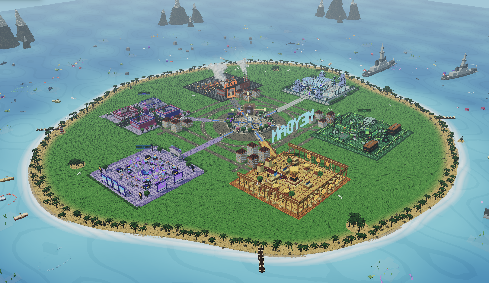
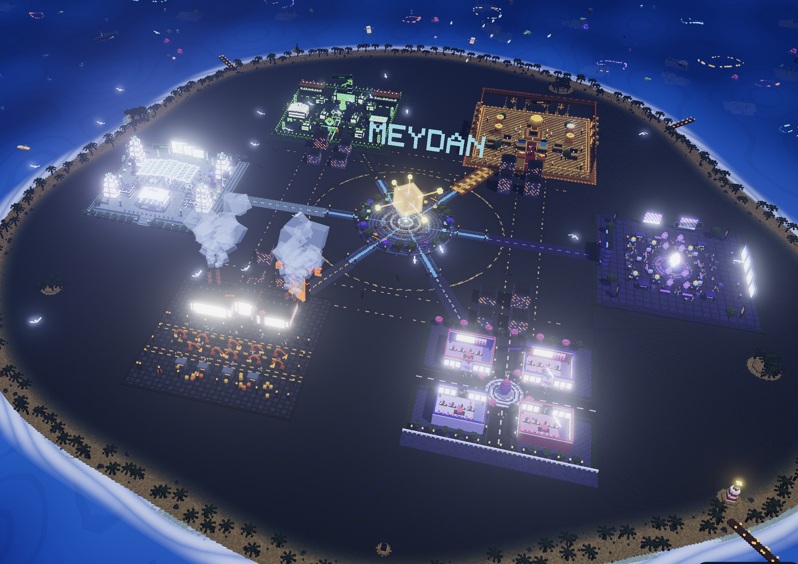
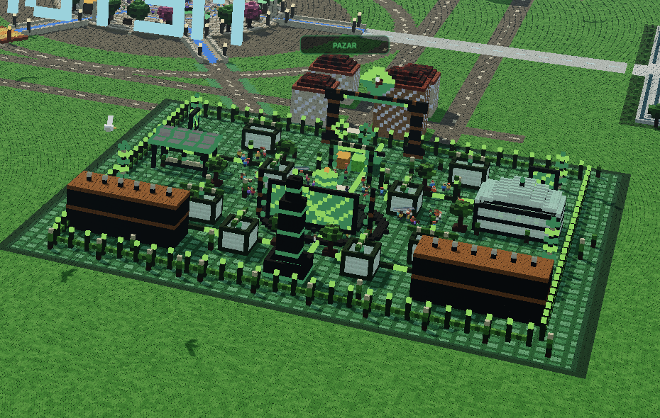
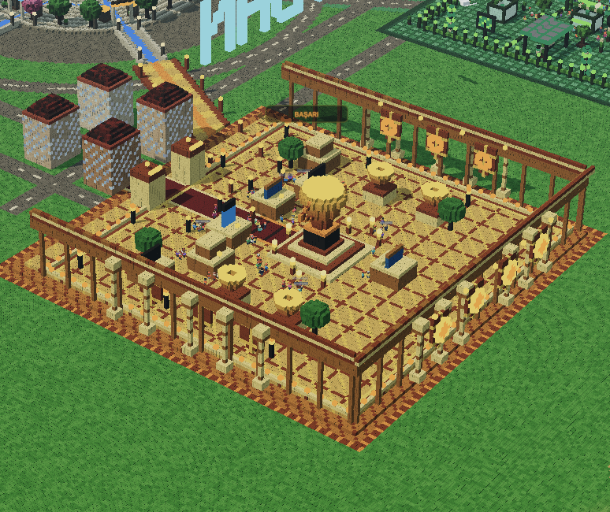
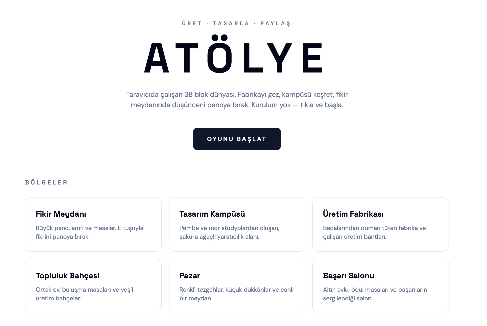
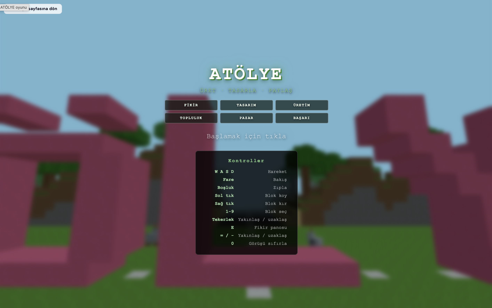

# Meydan — içine gir.

**🔗 Canlı (Güncel Hâli): [kayalarr-meydan.vercel.app](https://kayalarr-meydan.vercel.app)** — ana Meydan dünyası (AI Fikir Çekirdeği, katkı/onay/KP sistemi)

**🔗 Atölye (yedek erişim): [meydan-atolye.vercel.app](https://meydan-atolye.vercel.app)** — Atölye'nin bağımsız sürümü, ana siteye erişilemezse diye ayrıca yayınlandı

## Takım İsmi

**KAYALAR**

## Ürün İle İlgili Bilgiler

### Yarışma

TEKNOFEST NSosyal İnovasyon Yarışması

### Ürün İsmi

**Meydan**

### Ürün Açıklaması

Bugünkü sosyal platformlarda bir fikir paylaşılır, beğeni/yorum alır ve kaybolur gider — hiçbir zaman somut bir sonuca evrilmez. Fikir sahibi de, onu geliştirmek isteyenler de birbirini bulamaz.

**Meydan**, paylaşılan fikirlerin gerçek bir gelişim sürecinden geçtiği ve bu sürecin 3B, herkesin **aynı anda birlikte bulunduğu tek bir ortak dünyada** görselleştiği bir platform vizyonuyla yola çıkar — yapay zekânın herkese ayrı, izole bir dünya ürettiği bir sistem değil. Bir fikir, merkezdeki meydandan açılan sabit bir hat üzerinde ilerler: **Fikir → Tasarım → Üretim → Topluluk → Pazar → Başarı**.

| # | Bölge | Ne işe yarar |
|---|-------|---------------|
| 1 | **Fikir** | Fikir paylaşılır, Fikir Çekirdeği analiz edip yönlendirir |
| 2 | **Tasarım** | İsteyen kullanıcılar fikre katkı/geliştirme önerisi sunar, sahibi onaylar |
| 3 | **Üretim** | Onaylanan tasarım somut bir ürüne/prototipe dönüşür |
| 4 | **Topluluk** | Geri bildirim alınır, tartışılır, iyileştirilir |
| 5 | **Pazar** | Ürün paylaşılır, gerçek değer kazanmaya başlar |
| 6 | **Başarı** | Fikir sahibi + tüm katkı verenler Katkı Puanı (KP) ile ödüllenir |

Fikrin sahibi her aşamada sahip kalır; katkı verenler kendi KP'sini kendi emeğiyle kazanır. Bu akışın 3B dünya karşılığı bugün itibarıyla **gezilebilir** durumda; **fikir gönderimi, AI Fikir Çekirdeği'nin bölge yönlendirmesi, katkı/onay akışı ve kalıcı Katkı Puanı defteri artık gerçek** (bkz. [Sprint 4](#sprint-4) ve [Sprint 5](#sprint-5)). Gerçek zamanlı senkronizasyon ve temel toplum moderasyonu (bildir → otomatik gizle → şeffaf kayıt) da eklendi (bkz. [Sprint 6](#sprint-6)). Gerçek bir kimlik doğrulama (NSosyal ile SSO) ise NSosyal'in kendi altyapısına erişim gerektirdiği için henüz koda bağlanmadı — aşağıdaki [Sonraki Adımlar](#sonraki-adımlar) bölümünde tek kalan büyük madde budur.

<p align="center">
  
</p>
<p align="center"><sub>Görseller, projenin gerçekten çalıştırılan 3B ortamından alınmıştır.</sub></p>

### Ürün Özellikleri

- Merkezdeki hologram **Fikir Çekirdeği** etrafında kurulu, 6 sabit bölgeye (Fikir, Tasarım, Üretim, Topluluk, Pazar, Başarı) ayrılmış tek parça voxel dünya
- Şehirde gezdirilebilen bir karakter: joystick ile yürüme, kamera `OrbitControls` ile sürükle-döndür/yakınlaştır
- **İstanbul saatine göre gerçek zamanlı gündüz/gece döngüsü** — gökyüzü, ışıklandırma ve çekirdek parıltısı saatle birlikte değişir
- Çekirdeğin canlı durum göstergesi (`Dinliyor` / `Analiz ediyor`) ve NSOSYAL bilgi paneli
- `EffectComposer` + `UnrealBloomPass` ile ışık hüzmeleri ve gece parıltısı
- **"Fikrini Paylaş" paneli:** serbest metni AI Fikir Çekirdeği'ne gönderir; çekirdek fikri altı bölgeden birine yönlendirir, bir başlık/tema/renk ve önerilen Katkı Puanı üretir, sonuç doğru bölgenin üstünde beliren bir hologram katkı yapısı olarak 3B dünyaya işlenir ve kalıcı deftere kaydedilir
- **"Fikirler & Katkılar" paneli:** paylaşılan tüm fikirleri listeler; başkasının fikrine katkı sunabilir, kendi fikrine gelen katkıları onaylayıp/reddedebilirsin — onaylanan katkı, katkı verene KP kazandırır ve fikri bir sonraki bölgeye ilerletir
- **Liderlik tablosu:** onaylanan katkılara göre toplam Katkı Puanı sıralaması
- Herkesin aynı anda birlikte bulunduğu tek bir ortak 3B dünya: fikirler/katkılar kalıcı bir veritabanında yaşar, tüm kullanıcılar aynı veriye bakar (periyodik yenileme ile senkronize; gerçek zamanlı anlık iletim [Sonraki Adımlar](#sonraki-adımlar)'da)

### Farkımız

Bugünkü sosyal platformların büyük çoğunluğunda bir fikir paylaşılır, tepki alır ve unutulur. Meydan'ı farklı kılan dört temel nokta:

| | Klasik Sosyal Platformlar | Meydan |
|---|---|---|
| **Fikrin Akıbeti** | Beğeni/yorum alır, sonra kaybolur gider; somut bir sonuca evrilmez. | Sabit 6 aşamalı bir süreçte (Fikir → Tasarım → Üretim → Topluluk → Pazar → Başarı) somut ürüne evrilir. |
| **Dünya Yapısı** | Her kullanıcıya ayrı, izole bir akış/feed sunulur. | Herkesin **aynı anda birlikte bulunduğu** tek bir ortak 3B dünya; yapay zekâ herkese ayrı bir dünya üretmez. |
| **Katkı Sahipliği** | Kim neye ne kadar katkı sundu belirsizdir. | Katkı Puanı (KP) ile her katkı verenin emeği şeffaf ve ölçülebilir şekilde kayıt altına alınır. |
| **Süreç Şeffaflığı** | Fikir bir kez paylaşılır, sonraki süreç görünmezdir. | Fikrin bölgeden bölgeye ilerleyişi 3B ortamda ışık hatlarıyla canlı olarak izlenebilir. |

### Hedef Kitle

- Fikir sahibi bireyler ve girişimciler
- Ürün geliştirmeye katkı sunmak isteyen tasarımcı/mühendisler
- Sosyal inovasyon topluluğu
- Öğrenci girişim ekipleri
- Fikirlerin geliştirilme sürecini takip etmek isteyen mentor ve yatırımcılar

### Sprint Takibi

Görevler [Issues](../../issues) üzerinde, [Milestones](../../milestones) ile sprint bazlı takip edilir. Etiketler: `sprint`, `3d-dünya`, `karakter`, `ai-katmanı`, `rapor`.

---

## Sprint 1

### Sprint 1 Notları

Sprint 1 kapsamında ürün fikrinin netleştirilmesi, 6 bölgelik akış mimarisinin tasarlanması ve 3B dünyanın temel iskeletinin (proje kurulumu, sahne/kamera/ışıklandırma) kurulması hedeflenmiştir.

### Sprint 1 Goal

Sprint 1'in hedefi; TanStack Start + Three.js tabanlı proje iskeletini kurmak, temel voxel sahne render hattını (kamera, ışıklandırma, `OrbitControls`) çalışır hâle getirmek ve 6 bölgenin yerleşim planını netleştirmektir.

### Sprint 1 İçin Seçilen Görevler

**To-do**
- Karakter hareketi ve joystick entegrasyonunun tasarlanması
- İstanbul saatine göre gündüz/gece mantığının planlanması

**In Progress**
- 6 bölgenin (Fikir, Tasarım, Üretim, Topluluk, Pazar, Başarı) voxel yerleşim planının çıkarılması
- Merkez hologram çekirdeğin ilk taslağı

**Complete**
- GitHub repository açılması
- TanStack Start (React 19 + Vite + Nitro) proje iskeleti
- Tailwind CSS v4 + Radix UI (shadcn tabanlı) ile temel arayüz bileşenleri
- Three.js temel sahne kurulumu: kamera, ışıklandırma, `OrbitControls`

### Sprint 1 Ürün Durumu

Sprint 1 sonunda proje iskeleti ve temel 3B sahne render hattı kurulmuştur. 6 bölgenin yerleşim planı netleşmiş, ancak henüz tüm bölgeler voxel olarak inşa edilmemiştir; asıl amaç Sprint 2'de tüm dünyayı inşa etmek için gerekli altyapıyı hazırlamaktır.

### Sprint 1 Review

Sprint 1 boyunca yapılan işler değerlendirilmiştir. Proje iskeletinin ve temel render hattının kurulması olumlu bulunmuştur. Karakter hareketi ve gündüz/gece mantığının Sprint 2'ye taşınmasına karar verilmiştir.

Alınan kararlar:
- 6 bölgenin sabit konumlarda kalmasına, merkezdeki çekirdeğe ışık hatlarıyla bağlanmasına karar verilmiştir.
- Sprint 2'de tüm bölgelerin voxel olarak inşa edilmesine ve karakter/joystick entegrasyonuna odaklanılması kararlaştırılmıştır.

### Sprint 1 Retrospective

İlk sprintte sahne/render mimarisine beklenenden fazla zaman ayrıldığı, bunun karşılığında Sprint 2'nin daha hızlı ilerlemesi için sağlam bir temel oluştuğu değerlendirilmiştir.

Alınan kararlar:
- Sahne/render mimarisi erken sprintte sağlamlaştırılmalı, sonraki sprintler bunun üzerine katman eklemelidir.
- Her bölge için görev sorumluluğu net şekilde ayrılmalıdır.

---

## Sprint 2

### Sprint 2 Notları

Sprint 1'de kurulan render hattı üzerine, Sprint 2 kapsamında **6 bölgenin tamamının voxel olarak inşası**, karakter/joystick ile gezinme ve İstanbul saatine göre gündüz/gece döngüsüne odaklanılmıştır.

### Sprint 2 Goal

Sprint 2'nin hedefi; 6 bölgenin (özellikle Üretim ve Topluluk) voxel dünyada somut karşılıklarını inşa etmek, karakteri joystick ile şehirde gezdirilebilir hâle getirmek ve gerçek zamanlı gündüz/gece döngüsünü çalıştırmaktır.

### Sprint 2'de Ele Alınan Görevler

**To-do**
- Fikir paylaşım formunun arayüz taslağı

**In Progress**
- NPC'lerin bölgelere yerleştirilmesi ve sahneye canlılık katılması

**Complete**
- **Üretim** ve **Topluluk** bölgelerinin voxel olarak inşası
- Karakter hareketi ve `Joystick` bileşeniyle gezinme
- İstanbul saatine göre gerçek zamanlı gündüz/gece döngüsü
- Merkez hologram çekirdeğin (Fikir Çekirdeği) sahneye entegrasyonu

### Sprint 2 Ürün Durumu

Sprint 2 sonunda Üretim ve Topluluk bölgeleri, merkez çekirdeğe ışık hatlarıyla bağlı, kendi voxel yerleşimine sahip gezilebilir 3B alanlar hâline gelmiştir. Karakter joystick ile şehirde dolaştırılabilmekte, gündüz/gece döngüsü İstanbul saatine göre gerçek zamanlı işlemektedir.

#### Sprint 2 Ürün Görselleri

<table>
  <tr>
    <td width="50%">
      
      <p align="center"><b>Üretim</b><br/><sub>Bölgenin voxel dünyadaki somut karşılığı</sub></p>
    </td>
    <td width="50%">
      
      <p align="center"><b>Topluluk</b><br/><sub>Merkez çekirdeğe ışık hatlarıyla bağlı bölge</sub></p>
    </td>
  </tr>
</table>

### Sprint 2 Review

Sprint 2 sonunda ekip, Üretim ve Topluluk bölgelerinin somut 3B karşılıklarını ve karakter gezinme deneyimini birlikte değerlendirmiştir. Sprint 1'de hedeflenen "render altyapısı" hedefinin ötesine geçilerek, dünyanın gezilebilir hâle geldiği görülmüştür.

Alınan kararlar:
- Bölgeler arası ışık hattı efektinin dünyayı bir bütün olarak okunabilir kıldığı olumlu bulunmuş, Sprint 3'te kalan bölgelere (Pazar) ve genel görsel cilaya odaklanılmasına karar verilmiştir.
- Fikir paylaşımı gibi veri gerektiren özelliklerin, dünya tamamlandıktan sonraki bir aşamaya bırakılmasına karar verilmiştir.

### Sprint 2 Retrospective

Bölge bazlı görev dağılımının (her bölge = bağımsız bir voxel alan) paralel çalışmayı kolaylaştırdığı görülmüştür. Karakter/joystick entegrasyonunun sahne mimarisiyle uyumlu ilerlediği değerlendirilmiştir.

Alınan kararlar:
- Görsel/dünya işleri ile veri/backend işleri net şekilde ayrılmalı, karıştırılmamalıdır.
- Her bölgenin voxel inşası bittiğinde ekip içi kısa bir gözden geçirme yapılmalıdır.

---

## Sprint 3

### Sprint 3 Notları

Sprint 2 sonunda dünyanın büyük kısmı gezilebilir hâle gelmişti; Sprint 3 kapsamında **Pazar** bölgesinin voxel inşası tamamlanmış, ayrıca dünyanın genel görsel cilasına (bloom efektleri, gece ışıklandırması, çekirdek durum animasyonu) odaklanılmıştır.

### Sprint 3 Goal

Sprint 3'ün hedefi; **Pazar** bölgesinin voxel dünyada inşa edilmesi, `EffectComposer` + `UnrealBloomPass` ile görsel cilanın tamamlanması, çekirdeğin canlı durum göstergesinin (`Dinliyor` / `Analiz ediyor`) arayüze eklenmesi ve dünyanın sunuma hazır hâle getirilmesidir.

### Sprint 3'te Tamamlanan İşler

**Done**
- **Pazar** bölgesinin meydan çevresinde voxel olarak inşası
- `EffectComposer` + `UnrealBloomPass` ile ışık hüzmeleri ve gece parıltısı
- Çekirdeğin canlı durum göstergesi (`Dinliyor` / `Analiz ediyor`) — şu an istemci tarafında simüle edilen bir görsel/metin döngüsü
- Uçtan uca TypeScript tip güvenliği taraması

**Devam Eden**
- **Başarı** bölgesinin KP ödüllendirme ekranıyla detaylandırılması
- Sunum/rapor hazırlığı

### Sprint 3 Ürün Durumu

Sprint 3 sonunda dünya, uçtan uca gezilebilir, gündüz/gece döngüsüne ve görsel cilaya sahip bir prototip hâline gelmiştir. Pazar bölgesi meydan çevresinde voxel yerleşimiyle görselleştirilmiş, çekirdeğin durum göstergesi arayüze eklenmiştir. Fikir paylaşımı, onay akışı ve KP hesaplaması bu aşamada henüz gerçek bir veri katmanına bağlı değildir (bkz. [Sonraki Adımlar](#sonraki-adımlar)).

#### Sprint 3 Ürün Görselleri

<table>
  <tr>
    <td width="50%">
      
      <p align="center"><b>Pazar</b><br/><sub>Meydan çevresinde voxel olarak inşa edilen bölge</sub></p>
    </td>
    <td width="50%">
      
      <p align="center"><b>Gece Modu</b><br/><sub>Gündüz/gece döngüsü ve bloom cilasıyla tamamlanan dünya</sub></p>
    </td>
  </tr>
</table>

### Sprint 3 Review

Sprint 3 sonunda ekip, tamamlanan dünyayı uçtan uca birlikte değerlendirmiştir. Sprint 2'de hedeflenen "dünyanın gezilebilir hâle gelmesi" hedefine ulaşılmış, bunun ötesinde görsel cila eklenerek dünya sunuma hazır bir aşamaya getirilmiştir.

Alınan kararlar:
- Fikir paylaşımı, onay akışı ve KP sisteminin gerçek bir veri katmanına bağlanmasının bir sonraki geliştirme döngüsüne bırakılmasına karar verilmiştir.
- Gündüz/gece döngüsünün ve çekirdek animasyonunun, sunumlarda dünyanın "canlı" hissettirilmesi için kullanılmasına karar verilmiştir.

### Sprint 3 Retrospective

Görsel dünyanın (6 bölge, gündüz/gece, bloom) veri katmanından (fikir paylaşımı, KP) önce tamamlanmasının, ürünü erken aşamada somut ve gösterilebilir kıldığı; ancak "Farkımız" bölümünde anlatılan katkı/onay/KP mekanizmalarının henüz gerçek işlevler olmadığı, bunun net şekilde belirtilmesi gerektiği değerlendirilmiştir.

Alınan kararlar:
- Ürünün iddia ettiği akışın (Fikir → Başarı) hangi adımlarının gerçekten kodda karşılığı olduğu README'de açıkça belirtilmelidir.
- Bir sonraki sprintte veri katmanına (fikir paylaşımı, onay akışı, KP) öncelik verilmelidir.

---

## Sprint 4

### Sprint 4 Notları

Sprint 3 sonunda tespit edilen en önemli boşluk, "Farkımız" bölümünde anlatılan AI Fikir Çekirdeği'nin gerçekte sadece görsel bir animasyon olmasıydı. Sprint 4 kapsamında bu boşluk kapatıldı: fikir gönderimi ve bölge yönlendirmesi artık uçtan uca çalışan, gerçek bir yapay zekâ katmanına bağlı.

### Sprint 4 Goal

Sprint 4'ün hedefi; teknik rapordaki AI akışını (serbest metin → yapılandırılmış, Zod ile doğrulanmış plan → voxel motoruna parametre) koda geçirmek, bunu bir arayüz paneliyle kullanıcıya açmak ve AI servisi kullanılamadığında oyunun asla kırılmamasını sağlayan deterministik bir yedek mekanizma kurmaktır.

### Sprint 4'te Tamamlanan İşler

**Done**
- `ideaPlanSchema` (Zod): bölge, tema, başlık (≤6 kelime), `#rrggbb` renk, önerilen Katkı Puanı ve 14-26 öğelik yapı listesini (8-88 yerel koordinat aralığında) doğrulayan şema
- `analyzeIdea` sunucu fonksiyonu (`createServerFn`): Vercel AI SDK'nın `generateObject`'i ve `@ai-sdk/google` sağlayıcısıyla gerçek bir Gemini modeline (`GOOGLE_GENERATIVE_AI_API_KEY` tanımlıysa) bağlanır; istemci paketine AI SDK kodu hiç dahil edilmez (build çıktısı ile doğrulandı)
- `fallbackPlan`: anahtar tanımlı değilse veya model çağrısı başarısız/zaman aşımına uğrarsa devreye giren, anahtar kelime tabanlı bölge tahmini yapan deterministik üretici — aynı metin her zaman aynı planı üretir
- `planToVoxels`: doğrulanmış planı, doğru bölgenin üstünde çatıların üzerinde süzülen bir hologram katkı yapısına (`Voxel[]`) çevirir; çakışma riski olmadan sahneye eklenir
- **"Fikrini Paylaş"** arayüz paneli (`IdeaSquare.tsx`): metin girişi, çekirdek durumu, sonuç kartı (bölge/tema/renk/KP) ve "yapay zekâ ile mi yoksa deterministik plan ile mi analiz edildi" şeffaflığı
- Sahneye dünyanın kamera/karakter durumunu bozmadan yeni katkı yapıları ekleyen ayrı bir React effect'i (`sceneRef` + `contributions`)

### Sprint 4 Ürün Durumu

Sprint 4 sonunda bir kullanıcı gerçekten fikrini yazıp gönderebiliyor; AI Fikir Çekirdeği (anahtar tanımlıysa Gemini, değilse deterministik plan) fikri analiz edip doğru bölgeye yönlendiriyor ve sonuç, o bölgenin üstünde beliren yeni bir hologram yapısı olarak 3B dünyaya işleniyor. Bu, `npm run build` çıktısında AI SDK kodunun yalnızca sunucu paketinde yer aldığı ve tarayıcıda üç ayrı fikir gönderiminin doğru bölge/renk/koordinatlarla sahneye eklendiği (konsol izleriyle) doğrulanmıştır. Katkı/onay akışı ve kalıcı bir KP defteri henüz bu kapsamda değildir.

### Sprint 4 Review

Sprint 4 sonunda ekip, artık gerçekten çalışan bir AI Fikir Çekirdeği'ni birlikte test etmiştir. Sprint 3'ün retrospective'inde alınan "iddia edilen ile kodda karşılığı olan net ayrılmalı" kararı doğrultusunda, README'deki ilgili bölümler de güncellenmiştir.

Alınan kararlar:
- Deterministik fallback'in varlığı, AI anahtarı olmadan da demo/jüri gösteriminin güvenilir şekilde yapılabilmesini sağladığı için kalıcı bir tasarım kararı olarak korunacaktır.
- Bir sonraki sprintte katkı/onay akışı ve kalıcı KP defterine öncelik verilmesine karar verilmiştir.

### Sprint 4 Retrospective

TanStack Start'ın import-protection kuralının `**/server/**` desenini dosya yoluna göre kör bir şekilde uyguladığı (içeriğin `createServerFn` olup olmadığına bakmaksızın) sprint içinde öğrenilen önemli bir teknik detaydır; sunucu fonksiyonları bu yüzden `src/lib/` altında, sıradan dosya adlarıyla tutulmuştur.

Alınan kararlar:
- Framework'e özgü konvansiyonlar (klasör adlandırma, import-protection kuralları) varsayılmadan önce gerçek bir build ile doğrulanmalıdır.
- Yeni bir dış servis entegrasyonu eklenirken, önce "servis yokken ne olur?" sorusunun cevabı (fallback) tasarlanmalıdır.

---

## Sprint 5

Katkı/onay akışı ve kalıcı **Katkı Puanı (KP) defteri** gerçek bir veritabanına (Postgres) bağlandı: `saveIdea`/`listIdeas` fikirleri kalıcı olarak saklar; `proposeContribution`/`decideContribution` katkı sunma ve fikir sahibinin onay/red vermesini sağlar; onaylanan katkı **KP kazandırır ve fikri `nextRegion` ile bir sonraki bölgeye ilerletir** — görsel bir simülasyon değil, gerçek bir veri değişikliği. **"Fikirler & Katkılar"** paneli (liderlik tablosu dahil) ve temel bir spam/moderasyon denetimi eklendi.

**Doğrulama:** yerel bir Postgres'e karşı iki farklı kullanıcı kimliğiyle uçtan uca test edildi — katkı sun → onayla → bölge ilerlesin → liderlik tablosunda görün, hepsi çalıştı.

Aynı sprintte dünyaya yeni bir **Atölye** inşa alanı eklendi (bkz. Sprint 6) — meydandaki bir kapıdan girilen, blok yerleştirilebilen ayrı bir bölüm.

#### Sprint 5 Güncel Görünüm

<table>
  <tr>
    <td width="50%"></td>
    <td width="50%"></td>
  </tr>
  <tr>
    <td width="50%"></td>
    <td width="50%"></td>
  </tr>
</table>

**Kalan işler:** gerçek zamanlı (websocket) senkronizasyon henüz yok, katkı/onay şu an yalnızca metinle yapılıyor (bkz. [Sonraki Adımlar](#sonraki-adımlar)).

---

## Sprint 6

Bu sprintte **iki ayrı hat birleştirildi**: tasarım ekibinin güncellediği yeni dünya (Lovable) ile daha önce kurulan AI Fikir Çekirdeği + katkı/onay/KP sistemi.

### Tamamlanan İşler

- **Yeni dünya tasarımı koda aktarıldı:** ada merkezine büyük **"MEYDAN"** tabelası, yeniden tasarlanan **Başarı** (pergolalı ödül tapınağı) ve **Pazar** (tezgah düzeni) bölgeleri, bölge isimlerinin haritada okunaklı etiketlerle gösterilmesi
- **Yeni: Atölye** — meydanda **Üretim Atölyesi kapısından** girilen, `/atolye` üzerinden 6 bölgeye tematik kartlarla ulaşılan, `/insa` sayfasında blok yerleştirip kırabildiğin bağımsız bir 3B inşa alanı
- **AI Fikir Çekirdeği + katkı/onay/KP sistemi yeni tasarıma yeniden bağlandı** — "Fikrini Paylaş" ve "Fikirler & Katkılar" panelleri, tüm sunucu fonksiyonları (`idea-core-ai.ts`, `ideas-db.ts`, `db.ts`) hiçbir veri kaybı olmadan yeni koda taşındı
- **Gerçek bir hata bulundu ve düzeltildi:** `gemini-3.6-flash` varsayılan olarak "thinking" (derin düşünme) modunda çalışıyor ve bu, isteklerin 25 saniyeyi aşarak zaman aşımına uğramasına yol açıyordu; `thinkingLevel: "low"` ayarıyla çözüldü
- **Gerçek Gemini anahtarıyla yeniden doğrulandı:** düzeltmeden sonra birden fazla fikir gönderimi **"YAPAY ZEKÂ İLE ANALİZ EDİLDİ"** kaynağıyla, tutarlı ve anlamlı sonuçlar üretti (bkz. örnek: "Sokak Hayvanları Ortak Besleme Noktaları" → Topluluk bölgesi, 65 KP)
- `npm run build` ile client bundle'ın `pg`/AI SDK kodu içermediği yeniden doğrulandı
- **Atölye'nin (`/atolye`) "Fikir Panosu"su gerçek AI Fikir Çekirdeği + katkı sistemine bağlandı:** oyun vanilla JS/iframe içinde çalıştığı için sunucu fonksiyonlarını doğrudan çağıramıyor; bu yüzden bir `postMessage` köprüsü kuruldu (`public/game/js/game.js` ↔ `src/routes/atolye.tsx`). Panoda paylaşılan bir fikir artık gerçekten `analyzeIdea` (Gemini/fallback) ile analiz edilip `saveIdea` ile aynı Postgres deftere kaydediliyor — daha önce sadece `localStorage`'a yazan, tamamen ayrı bir sahte pano idi. Uçtan uca, yerel bir Postgres'e karşı gerçek bir istekle doğrulandı: Atölye'de paylaşılan fikir hem oyunun kendi panosunda hem de ana sayfadaki "Fikirler & Katkılar" panelinde aynı kayıt olarak görüldü
- Aynı pointer-lock/mavi ekran hatası (`WrongDocumentError`, iframe içinde `requestPointerLock` başarısız oluyordu) `/atolye` ve `/insa` oyunlarının kendi kod kopyalarında da bulunup düzeltildi — dünya artık pointer lock başarısız olsa bile render ediliyor, WASD ile oynanabiliyor
- **Gerçek Gemini anahtarı production'a (Vercel) eklendi** ve canlı ortamda ikinci, daha ciddi bir güvenilirlik hatası bulunup düzeltildi: şema, modelden `yapilar` alanında 14-26 adet 3B koordinat üretmesini istiyordu; model bunu güvenilir biçimde üretemiyor (genelde 2-3 nokta döndürüp şema doğrulamasını başarısız kılıyor), bu da AI SDK'nin dahili onarım/tekrar deneme döngüsünü tetikleyip isteğin kendi zaman aşımı süresini aşmasına yol açıyordu — sonuç, canlıda her istek sessizce `fallback`'e düşüyordu. Çözüm: koordinat üretimi modelden alınıp deterministik koda taşındı (`generateStructurePoints`, aynı `fallbackPlan`'ın kullandığı üretici); modelin işi artık yalnızca sınıflandırma (bölge/tema/başlık/renk/KP/uygunluk). Basit istekle gerçek üretim ~2-3 saniyeye indi ve doğrulama artık tutarlı geçiyor
- Not: kullanılan Gemini anahtarı ücretsiz katmanda, dakikada 20 istek sınırı var; sınıra takılan bir istek AI SDK'nin backoff ile tekrar denemesi yüzünden birkaç on saniye sürebilir, bu yüzden sunucu tarafı zaman aşımı 30 saniyede tutuldu
- **Production'a gerçek bir Postgres bağlandı** (Vercel'in Neon marketplace entegrasyonu üzerinden); `DATABASE_URL`/`POSTGRES_URL` otomatik enjekte edildi ve canlıda uçtan uca doğrulandı — bir fikir gönderildi, kalıcı olarak kaydedildi ve "Fikirler & Katkılar" panelinde göründü. Artık ana sitenin (`kayalarr-meydan.vercel.app`) **tamamı** (3B dünya, AI Fikir Çekirdeği, katkı/onay/KP defteri) gerçek altyapıyla canlıda çalışıyor
- **Gerçek zamanlı senkronizasyon eklendi** (Pusher Channels üzerinden, ücretsiz katman) — bir fikir/katkı değiştiğinde açık tüm istemcilere <1 saniyede bildirim gidiyor, periyodik yenilemeyi beklemeden; 15sn'lik döngü artık yalnızca bu mekanizma sessizce başarısız olursa diye 60sn'lik bir yedek. İki ayrı tarayıcı sekmesinde uçtan uca doğrulandı: birinde gönderilen fikir/katkı diğerinde hiçbir işlem yapılmadan anında belirdi
- **Temel toplum moderasyonu eklendi** — her fikir/katkının yanında bir "Bildir" (Spam/Uygunsuz/Diğer) seçeneği var; bir içerik en az iki farklı kullanıcı tarafından bildirilince otomatik gizleniyor (geri açma yok, kasıtlı). Gerçek bir admin rolü olmadığı için moderasyon şeffaflığa dayanıyor: gizlenen her şey, kim bildirdi/hangi gerekçeyle diye `/moderasyon` sayfasında herkese açık listeleniyor. İki farklı kullanıcı kimliğiyle uçtan uca doğrulandı: içerik 2. bildirimden sonra hem ana listeden hem de diğer açık sekmeden (gerçek zamanlı bildirimle) kayboldu, `/moderasyon`'da gerekçesiyle göründü
- **Atölye'nin ve `/insa`'nın (Üretim Atölyesi / MineWorld) Fikir Panosu'na artık "katkı sun" özelliği eklendi** — panodaki her gerçek fikrin yanında bir "Atölyede inşa ettiğinle katkı sun" butonu var; oyuncu ne inşa ettiğini yazıp gönderdiğinde bu, `proposeContribution` ile aynı gerçek onay/KP akışına giren normal bir katkı oluyor. **Açıkça belirtmek gerekir:** bu, oyunun blok yerleştirmeni otomatik algılayıp katkı üretmesi değil — oyuncunun ne inşa ettiğini kendi yazdığı, sonra fikir sahibinin onayına sunulan bir akış (tıpkı ana sitedeki "Katkı Sun" gibi)
- **`/insa` (MineWorld) da aynı Fikir Panosu köprüsüne bağlandı** — daha önce hiçbir sisteme bağlı olmayan, fikir panosu mekaniği bile içermeyen tamamen ayrı bir sandbox'tı; şimdi sağ üstteki "💡 Fikir Panosu" butonuyla (veya E tuşuyla) aynı gerçek AI + katkı sistemine erişiyor

### Şu An Gerçekten Çalışan Bütün

**Bir kullanıcı gerçek bir fikir yazabiliyor → AI Fikir Çekirdeği (gerçek Gemini ile) onu doğru bölgeye yönlendirip bir başlık/tema/KP öneriyor → fikir kalıcı olarak kaydediliyor → başka bir kullanıcı (ana siteden, Atölye'den ya da `/insa`'dan) ona katkı sunabiliyor → fikir sahibi onaylayabiliyor → onaylanan katkı gerçekten KP kazandırıp fikri bir sonraki bölgeye ilerletiyor → liderlik tablosunda görünüyor.** Bu değişiklikler tüm açık istemcilere gerçek zamanlı yayılıyor; uygunsuz bir fikir/katkı topluluk tarafından bildirilip otomatik gizlenebiliyor, şeffaf bir kayıtla. Bu döngünün tamamı hem yerelde hem de **canlı ortamda** (`kayalarr-meydan.vercel.app`), gerçek bir AI anahtarı, gerçek bir Postgres veritabanı ve gerçek bir Pusher bağlantısıyla uçtan uca test edilip doğrulanmıştır.

**Henüz gerçek olmayanlar (bilerek, açıkça):**
- **Blok yerleştirme/kırmanın kendisi** hâlâ otomatik olarak katkıya dönüşmüyor — Atölye ve `/insa` hâlâ görsel birer inşa sandbox'ı; katkı, oyuncunun panoya elle yazdığı bir açıklamayla oluyor, blok sayısı/şekli okunup değerlendirilmiyor
- Gerçek kimlik doğrulama yok (NSosyal SSO yerine tarayıcı takma adı) — bu, NSosyal'in kendi kimlik doğrulama altyapısına erişim gerektirdiği için ekip dışı bir bağımlılık; NSosyal'e paylaşıldıktan sonra ele alınması gereken tek madde budur
- Moderasyon hâlâ tam kapsamlı değil — bildirilen içerik otomatik ve geri döndürülemez şekilde gizleniyor; insan hakemli bir itiraz/inceleme süreci (yanlışlıkla gizlenen bir içeriğin geri açılması gibi) yok
- Kullanılan Gemini anahtarı ücretsiz katmanda (dakikada 20 istek sınırı); yoğun/art arda kullanımda ara sıra fallback'e düşebilir — bu durum arayüzde her zaman şeffafça belirtilir, gizlenmez

### Sprint 6 Ürün Görselleri

<table>
  <tr>
    <td width="50%"></td>
    <td width="50%"></td>
  </tr>
</table>

---

## Kullanılan Teknolojiler ve Mimari

### Klasörler

- `src/routes/` — TanStack Start dosya tabanlı route'lar: `/` (ana dünya), `/atolye` (Atölye giriş sayfası + Fikir Panosu köprüsü), `/insa` (MineWorld blok inşa modu + aynı köprü), `/moderasyon` (şeffaf, herkese açık moderasyon kaydı)
- `src/components/` — `IdeaSquare.tsx` (ana 3B sahne bileşeni + "Fikrini Paylaş" paneli), `IdeasBrowser.tsx` ("Fikirler & Katkılar" paneli, liderlik tablosu, bildirme/moderasyon UI'ı), `Joystick.tsx` (karakter kontrolü), `ui/` (shadcn tabanlı arayüz bileşenleri)
- `src/lib/` — `voxel-world.ts` (voxel dünya üretimi: 6 bölge, çekirdek, NPC'ler), `istanbul-time.ts` (gündüz/gece saat mantığı), `seascape.ts` (ada çevresindeki deniz), `idea-core.ts` (Zod şeması, deterministik fallback, plan→voxel dönüşümü — izomorfik), `idea-core-ai.ts` (AI Fikir Çekirdeği'nin `createServerFn` sunucu fonksiyonu), `db.ts` (paylaşılan Postgres bağlantı havuzu), `ideas-db.ts` (fikir/katkı/KP/moderasyon `createServerFn`'leri — bunlar da sunucuda çalışır), `pusher-server.ts` (gerçek zamanlı bildirim yayıncısı, sunucu-only), `use-meydan-realtime.ts` (istemci tarafı Pusher aboneliği), `use-meydan-user.ts` (kalıcı takma ad hook'u)
- `public/game/`, `public/mineworld/` — Atölye ve `/insa`'nın bağımsız vanilla JS/Three.js oyun motorları; `js/game.js`'lerindeki Fikir Panosu, `postMessage` ile `atolye.tsx`/`insa.tsx`'e bağlanır (sunucu fonksiyonlarını doğrudan çağıramadıkları için)

### Mimari Genel Bakış

```
┌──────────────────────────────┐        analyzeIdea()        ┌──────────────────────────────┐
│  TanStack Start (SSR kabuk)   │  ───────────────────────────▶│  idea-core-ai.ts (sunucu)      │
│  src/routes/index.tsx          │      RPC (createServerFn)    │  generateObject + google()     │
└───────────────┬────────────────┘                              │  → ideaPlanSchema (Zod)        │
                │ render                                        └───────────────┬────────────────┘
                ▼                                                                │ başarısız/anahtar yok
┌──────────────────────────────────────────────┐                                ▼
│  IdeaSquare.tsx — Three.js sahnesi             │                 ┌────────────────────────────┐
│  OrbitControls · EffectComposer+UnrealBloom    │◀── contribution ─│  idea-core.ts: fallbackPlan  │
│  "Fikrini Paylaş" paneli                       │   (planToVoxels) │  (izomorfik, deterministik)  │
└───────┬─────────────────┬──────────────┬──────┘                 └────────────────────────────┘
        │                 │              │
        ▼                 ▼              ▼
 voxel-world.ts     istanbul-time.ts   Joystick.tsx
 6 bölge + çekirdek   gündüz/gece        karakter
 + NPC üretimi          saat mantığı      girdisi

┌───────────────────────────────┐   saveIdea / listIdeas / propose-      ┌───────────────────────────┐
│  IdeasBrowser.tsx               │   Contribution / decideContribution   │  ideas-db.ts (sunucu)      │
│  Fikirler · Katkı Sun · Onayla  │ ─────────────────────────────────────▶│  db.ts (pg Pool)           │
│  · Liderlik Tablosu · 15sn poll │◀────────────────────────────────────  │  → Vercel Postgres / Neon  │
└───────────────────────────────┘        IdeaRecord[] / KP sıralaması    └───────────────────────────┘
```

`voxel-world.ts`, 6 bölgeyi (`REGIONS`: Fikir, Tasarım, Üretim, Topluluk, Pazar, Başarı) ve merkezdeki hologram çekirdeği (`buildCore`) prosedürel olarak üretir; `IdeaSquare.tsx` bu veriyi Three.js sahnesine render eder, `istanbul-time.ts`'den gelen saate göre gündüz/gece geçişini uygular ve `Joystick.tsx` üzerinden gelen girdiyle karakteri hareket ettirir. Kullanıcı bir fikir gönderdiğinde `analyzeIdea` sunucu fonksiyonu çağrılır; sonuç (AI'dan ya da fallback'ten) hem `planToVoxels` ile bölgenin üstünde süzülen bir hologram katkı yapısına çevrilip sahneye eklenir, hem de `saveIdea` ile kalıcı deftere kaydedilir. `IdeasBrowser.tsx`, `ideas-db.ts` üzerinden fikirleri/katkıları okur ve yazar; bir katkı onaylandığında fikrin bölgesi `nextRegion` ile ilerler ve katkı veren KP kazanır.

### İstemci

- **TanStack Start** (React 19 + Vite + Nitro) — SSR uygulama kabuğu
- **Three.js** — prosedürel voxel dünya üretimi, `OrbitControls`, `EffectComposer` + `UnrealBloomPass`
- **Tailwind CSS v4 + Radix UI** (shadcn tabanlı) — arayüz bileşenleri
- **TypeScript** — uçtan uca tip güvenliği

### Yapay Zekâ Katmanı (Sprint 4)

- **Vercel AI SDK (`generateObject`) + `@ai-sdk/google`** — `GOOGLE_GENERATIVE_AI_API_KEY` tanımlıysa gerçek bir Gemini modeline (`gemini-3.6-flash`, `MEYDAN_GEMINI_MODEL` ile değiştirilebilir) bağlanır; gerçek bir anahtarla uçtan uca test edilmiştir
- **Zod (`ideaPlanSchema`)** — model çıktısını bölge/tema/başlık/renk/KP/yapı listesi şemasına zorlar; şema dışı çıktı asla oyun motoruna parametre olamaz
- **Deterministik `fallbackPlan`** — anahtar tanımlı değilse veya çağrı başarısız/zaman aşımına uğrarsa devreye girer; anahtar kelime tabanlı bölge tahmini yapar, aynı metin için her zaman aynı planı üretir
- Çekirdeğin `Dinliyor` / `Analiz ediyor` ambiyans döngüsü hâlâ görsel bir animasyondur; "Fikrini Paylaş" panelindeki analiz ise artık gerçek bir sunucu çağrısıdır (AI ya da fallback kaynağı arayüzde şeffafça belirtilir)

### Veri Katmanı (Sprint 5)

- **Postgres** (`pg` istemcisi, Vercel Postgres/Neon uyumlu) — `meydan_ideas`, `meydan_contributions` ve `meydan_flags` tabloları; ilk çağrıda şema otomatik oluşturulur (`ensureSchema`)
- **Katkı/onay akışı** — `proposeContribution` bir katkıyı `pending` olarak kaydeder; `decideContribution` yalnızca fikrin `owner_name`'iyle eşleşen isteklere onay/red izni verir (sunucu tarafında doğrulanır, istemciye güvenilmez)
- **KP defteri ve bölge ilerlemesi** — onaylanan her katkı, katkı verene KP kazandırır ve fikri `nextRegion` ile bir sonraki bölgeye taşır; `getLeaderboard` bunları toplam KP'ye göre sıralar
- **Temel toplum moderasyonu** — `reportIdea`/`reportContribution`, bir içerik en az `HIDE_THRESHOLD` (2) farklı kullanıcı tarafından bildirilince otomatik gizler; `listModerationQueue` gizlenen içeriği gerekçesiyle `/moderasyon` sayfasında şeffafça listeler
- **Gerçek zamanlı senkronizasyon** (Sprint 6/Pusher Channels) — veri her değiştiğinde (`pusher-server.ts` → `notifyIdeasChanged`) tüm açık istemcilere websocket üzerinden anında bildirim gider (`use-meydan-realtime.ts`); yapılandırılmamışsa sessizce 60 saniyelik bir yedek yenilemeye düşer
- Veritabanı bağlantısı tanımlı değilse "Fikirler & Katkılar" paneli anlaşılır bir hata gösterir; 3B dünya ve AI Fikir Çekirdeği bundan etkilenmez

## Sonraki Adımlar

- **Gerçek kimlik doğrulama (NSosyal ile SSO)** — NSosyal'in kendi kimlik doğrulama altyapısına erişim gerektirdiği için ekip dışı bir bağımlılık; ancak proje NSosyal'e paylaşıldıktan sonra ele alınabilir. Yalnızca tarayıcı başına kalıcı bir takma ad var, gerçek bir hesap sistemi değil
- Blok yerleştirme/kırmanın kendisinin okunup otomatik bir katkı önerisine dönüştürülmesi — şu an oyuncu ne inşa ettiğini panoya elle yazıyor (bkz. Sprint 6); blokların sayısı/şekli/konumu değerlendirmeye girmiyor
- İnsan hakemli bir moderasyon itiraz/inceleme akışı — şu an bildirilen içerik eşiğe ulaşınca otomatik ve kalıcı olarak gizleniyor, yanlışlıkla gizlenmiş bir içeriği geri açacak bir mekanizma yok

## Kurulum

```bash
git clone https://github.com/kayabetul744/KAYALARR-MEYDAN.git
cd KAYALARR-MEYDAN
npm install
npm run dev       # http://localhost:5173
```

```bash
npm run build      # üretim derlemesi
npm run preview    # üretim derlemesini yerelde önizleme
npm run lint        # ESLint
npm run format       # Prettier
```

Katkı/onay akışı ve KP defteri için bir Postgres bağlantısı gerekir (`.env.example`'a bakın): Vercel'de proje panelinden bir Postgres (Neon) storage eklediğinizde `POSTGRES_URL` otomatik enjekte edilir; yerelde kendi Postgres'inizin bağlantı dizesini `DATABASE_URL` olarak `.env` dosyanıza girin. Tanımlı değilse 3B dünya ve AI Fikir Çekirdeği yine de çalışır, yalnızca "Fikirler & Katkılar" paneli bir hata gösterir.

## Ekip

KAYALAR — TEKNOFEST NSosyal İnovasyon Yarışması
