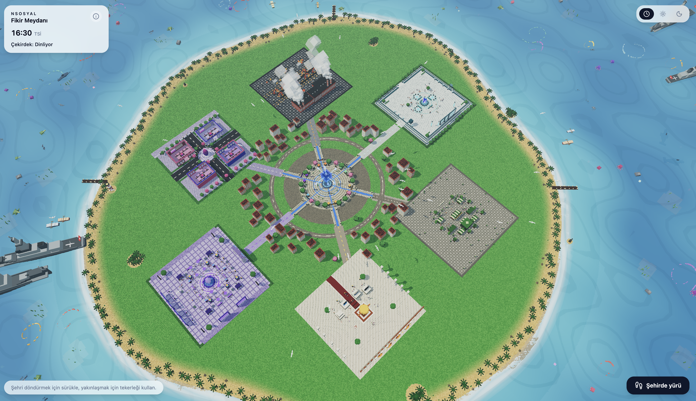
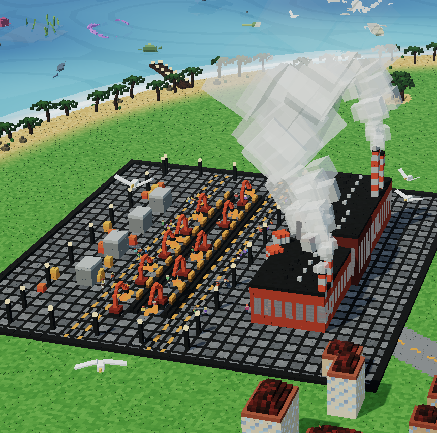
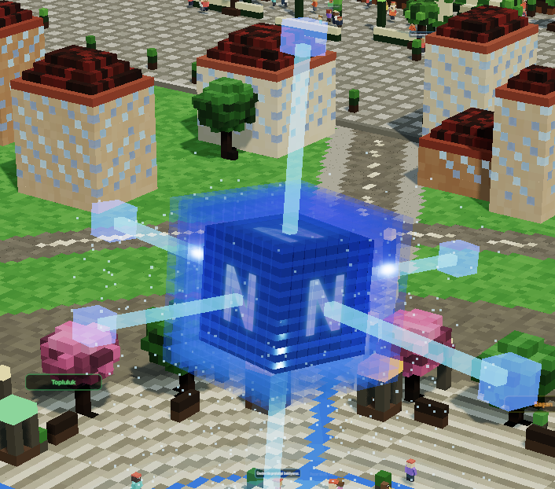
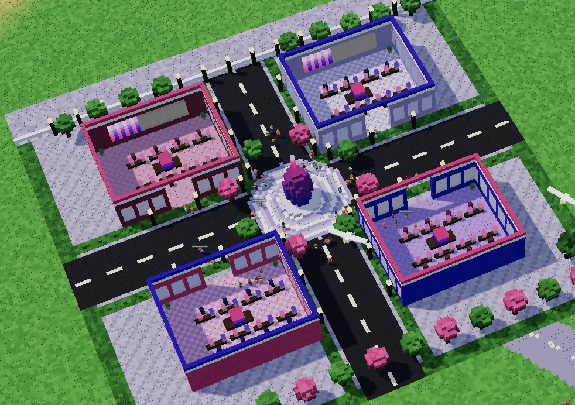
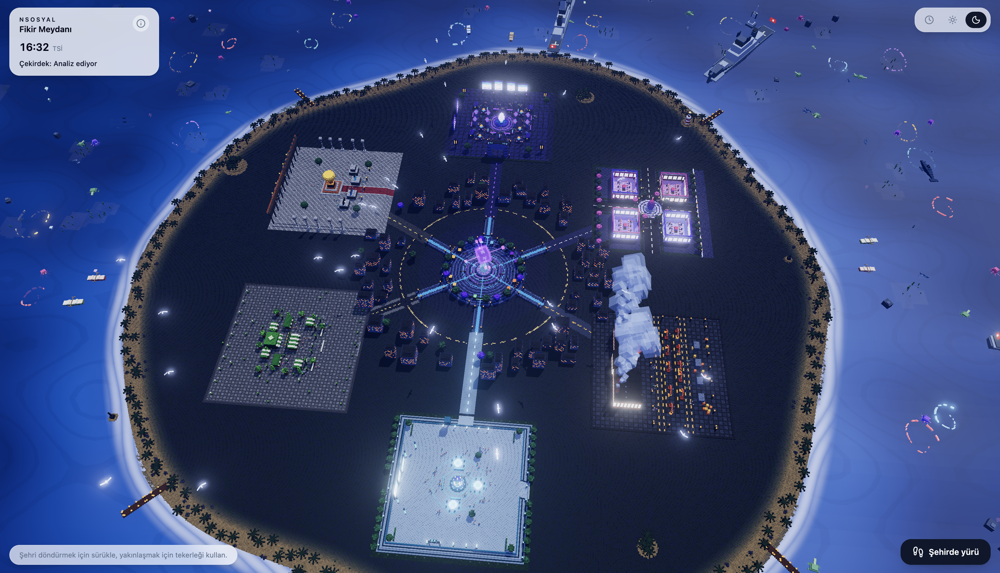

# Meydan — içine gir.

## Takım İsmi

**KAYALAR**

## Ürün İle İlgili Bilgiler

### Yarışma

TEKNOFEST NSosyal İnovasyon Yarışması

### Ürün İsmi

**Meydan**

### Ürün Açıklaması

Bugünkü sosyal platformlarda bir fikir paylaşılır, beğeni/yorum alır ve kaybolur gider — hiçbir zaman somut bir sonuca evrilmez. Fikir sahibi de, onu geliştirmek isteyenler de birbirini bulamaz.

**Meydan**, paylaşılan fikirlerin gerçek bir gelişim sürecinden geçtiği ve bu sürecin 3B, herkesin **aynı anda birlikte bulunduğu tek bir ortak dünyada** görselleştiği bir platformdur — yapay zekânın herkese ayrı, izole bir dünya ürettiği bir sistem değil. Bir fikir, merkezdeki meydandan açılan sabit bir hat üzerinde ilerler: **Fikir → Tasarım → Üretim → Topluluk → Pazar → Başarı**.

| # | Bölge | Ne işe yarar |
|---|-------|---------------|
| 1 | **Fikir** | Fikir paylaşılır, AI Fikir Çekirdeği analiz edip yönlendirir |
| 2 | **Tasarım** | İsteyen kullanıcılar fikre katkı/geliştirme önerisi sunar, sahibi onaylar |
| 3 | **Üretim** | Onaylanan tasarım somut bir ürüne/prototipe dönüşür |
| 4 | **Topluluk** | Geri bildirim alınır, tartışılır, iyileştirilir |
| 5 | **Pazar** | Ürün paylaşılır, gerçek değer kazanmaya başlar |
| 6 | **Başarı** | Fikir sahibi + tüm katkı verenler Katkı Puanı (KP) ile ödüllenir |

Fikrin sahibi her aşamada sahip kalır; katkı verenler kendi KP'sini kendi emeğiyle kazanır.

### Ürün Özellikleri

- Fikir paylaşımı ve AI Fikir Çekirdeği ile otomatik analiz/yönlendirme
- Fikre katkı/geliştirme önerisi sunma ve fikir sahibinin onay akışı
- Onaylanan tasarımın somut ürüne/prototipe dönüşüm takibi
- Topluluk geri bildirimi ve tartışma mekanizması
- Ürünün pazarda paylaşılıp gerçek değer kazanması
- Katkı Puanı (KP) ile şeffaf, emek bazlı ödüllendirme
- Herkesin aynı anda birlikte bulunduğu tek bir ortak 3B dünya (izole/kişiye özel dünyalar değil)
- Gündüz/gece döngüsü ve canlı AI durum göstergesiyle desteklenen sürükleyici arayüz

### Farkımız

Bugünkü sosyal platformların büyük çoğunluğunda bir fikir paylaşılır, tepki alır ve unutulur. Meydan'ı farklı kılan dört temel nokta:

| | Klasik Sosyal Platformlar | Meydan |
|---|---|---|
| **Fikrin Akıbeti** | Beğeni/yorum alır, sonra kaybolur gider; somut bir sonuca evrilmez. | Sabit 6 aşamalı bir süreçte (Fikir → Tasarım → Üretim → Topluluk → Pazar → Başarı) somut ürüne evrilir. |
| **Dünya Yapısı** | Her kullanıcıya ayrı, izole bir akış/feed sunulur. | Herkesin **aynı anda birlikte bulunduğu** tek bir ortak 3B dünya; yapay zekâ herkese ayrı bir dünya üretmez. |
| **Katkı Sahipliği** | Kim neye ne kadar katkı sundu belirsizdir. | Katkı Puanı (KP) ile her katkı verenin emeği şeffaf ve ölçülebilir şekilde kayıt altına alınır. |
| **Süreç Şeffaflığı** | Fikir bir kez paylaşılır, sonraki süreç görünmezdir. | Fikrin bölgeden bölgeye ilerleyişi 3B ortamda ışık hatlarıyla canlı olarak izlenebilir. |

### Hedef Kitle

- Fikir sahibi bireyler ve girişimciler
- Ürün geliştirmeye katkı sunmak isteyen tasarımcı/mühendisler
- Sosyal inovasyon topluluğu
- Öğrenci girişim ekipleri
- Fikirlerin geliştirilme sürecini takip etmek isteyen mentor ve yatırımcılar

### Sprint Takibi

Görevler [Issues](../../issues) üzerinde, [Milestones](../../milestones) ile sprint bazlı takip edilir. Etiketler: `sprint`, `ai-katmanı`, `3d-oyun`, `rapor`.

---

## Sprint 1

### Sprint 1 Notları

Sprint 1 kapsamında ürün fikrinin netleştirilmesi, 6 bölgelik akış mimarisinin tasarlanması ve 3B dünyanın temel iskeletinin kurulması hedeflenmiştir. Bu sprintte ana amaç, dünyanın merkez–uydu (hub-and-spoke) yerleşimini oturtmak, **Fikir** bölgesini çalışır hale getirmek ve geliştirme için gerekli teknik altyapıyı hazırlamaktır.

### Sprint 1 Goal

Sprint 1'in hedefi; 6 bölgenin ada üzerindeki sabit yerleşimini kurmak, TanStack Start + Three.js tabanlı proje iskeletini oluşturmak, AI Fikir Çekirdeği'nin ilk prototipini (Vercel AI SDK + Zod) hazırlamak ve GitHub proje yapısını düzenlemektir.

### Sprint 1 İçin Seçilen Görevler

**To-do**
- Wireframe / bölge yerleşim planının netleştirilmesi
- AI Fikir Çekirdeği'nin karar/yönlendirme şemasının (Zod) tasarlanması
- Product backlog'un oluşturulması

**In Progress**
- TanStack Start (React 19 + Vite + Nitro) proje iskeleti
- Three.js ile voxel/bloklu 3B dünya temeli (InstancedMesh, OrbitControls)
- **Fikir** bölgesi: fikir paylaşım akışının ilk prototipi

**Complete**
- GitHub repository açılması
- 6 bölgelik akış şemasının ve KP mantığının netleştirilmesi
- Tailwind CSS v4 + Radix UI ile temel arayüz bileşenleri

### Sprint 1 Ürün Durumu

Sprint 1 sonunda adanın merkez–uydu yerleşimi ve 6 sabit bölgenin temel 3B iskeleti kurulmuştur. Bu sprintte henüz her bölgenin tam işlevi hedeflenmemiştir; asıl amaç, Sprint 2'de geliştirilecek bölge içi etkileşimler için gerekli dünya altyapısını hazırlamaktır.

#### Sprint 1 Ürün Görselleri

<p align="center">
  
</p>
<p align="center"><sub>Adanın merkez–uydu yerleşimi: merkezdeki meydandan 6 sabit bölgeye uzanan yollar.</sub></p>

### Sprint 1 Review

Sprint 1 boyunca yapılan işler değerlendirilmiştir. Bölge yerleşiminin ve dünya iskeletinin kurulması olumlu bulunmuştur. Devam eden görevlerin (AI Fikir Çekirdeği şeması, Fikir bölgesi akışı) Sprint 2'ye taşınmasına karar verilmiştir.

Alınan kararlar:
- 6 bölgenin sabit konumlarda kalmasına, akışın bölgeler arası ışık hatlarıyla görselleştirilmesine karar verilmiştir.
- AI Fikir Çekirdeği çıktısının baştan Zod şemasıyla tip güvenli tasarlanmasına karar verilmiştir.
- Sprint 2'de Tasarım, Üretim ve Topluluk bölgelerinin işlevselleştirilmesine odaklanılması kararlaştırılmıştır.

### Sprint 1 Retrospective

İlk sprintte dünya mimarisine (grid yapısı, InstancedMesh render stratejisi) beklenenden fazla zaman ayrıldığı görülmüştür. Bu nedenle bölge içi etkileşim mantığının bir sonraki sprinte daha net görev paketleri hâlinde taşınmasına karar verilmiştir.

Alınan kararlar:
- Sahne/render mimarisi erken sprintte sağlamlaştırılmalı, sonraki sprintler bunun üzerine katman eklemelidir.
- Her bölge için görev sorumluluğu net şekilde ayrılmalıdır.
- Sprint board güncellemeleri daha düzenli tutulmalıdır.

---

## Sprint 2

### Sprint 2 Notları

Sprint 1'de kurulan dünya iskeleti üzerine, Sprint 2 kapsamında **Tasarım**, **Üretim** ve **Topluluk** bölgelerinin gerçek işlevlere kavuşturulmasına odaklanılmıştır. Bu sprintte planlama aşamasından çıkılıp bölgelerin görsel ve etkileşimsel karşılıkları somutlaştırılmıştır.

### Sprint 2 Goal

Sprint 2'nin hedefi; katkı/geliştirme önerisi sunma ve onay akışının (Tasarım), üretim hattı görselleştirmesinin (Üretim) ve geri bildirim/tartışma mekanizmasının (Topluluk) geliştirilmesi; ayrıca Katkı Puanı (KP) veri modelinin ilk sürümünün oluşturulmasıdır.

### Sprint 2'de Ele Alınan Görevler

**To-do**
- KP hesaplama algoritmasının detaylandırılması
- Topluluk bölgesinde tartışma/oylama arayüzü

**In Progress**
- **Tasarım** bölgesi: katkı/geliştirme önerisi sunma ve fikir sahibi onay akışı
- Katkı Puanı (KP) sisteminin veri modeli

**Complete**
- **Üretim** bölgesi: onaylanan tasarımın üretim hattında görselleştirilmesi
- **Topluluk** bölgesi: merkez çekirdeğe bağlı geri bildirim düğümünün 3B karşılığı

### Sprint 2 Ürün Durumu

Sprint 2 sonunda Üretim ve Topluluk bölgeleri, merkez çekirdeğe ışık hatlarıyla bağlı, kendi voxel grid'ine sahip çalışır 3B alanlar hâline gelmiştir. Üretim hattında robotik kollar ve taşıma bantları, Topluluk bölgesinde ise çekirdeğe bağlı bir etkileşim düğümü görselleştirilmiştir.

#### Sprint 2 Ürün Görselleri

<table>
  <tr>
    <td width="50%">
      
      <p align="center"><b>Üretim</b><br/><sub>Onaylanan tasarımın üretim hattında somut ürüne dönüşümü</sub></p>
    </td>
    <td width="50%">
      
      <p align="center"><b>Topluluk</b><br/><sub>Geri bildirim düğümü, çekirdeğe ışık hatlarıyla bağlı</sub></p>
    </td>
  </tr>
</table>

### Sprint 2 Review

Sprint 2 sonunda ekip, Üretim ve Topluluk bölgelerinin somut 3B karşılıklarını birlikte değerlendirmiştir. Sprint 1'de hedeflenen "dünya altyapısı" hedefinin ötesine geçilerek, akışın görsel olarak takip edilebilir hâle geldiği görülmüştür.

Alınan kararlar:
- Bölgeler arası ışık hattı efektinin, aktif veri akışını sezgisel biçimde göstermesi olumlu bulunmuş, Sprint 3'te tüm bölgelere yaygınlaştırılmasına karar verilmiştir.
- Tasarım bölgesindeki onay akışının Sprint 3'e sarkmasının, KP modelinin netleşmesini beklemesinden kaynaklandığı değerlendirilmiştir.

### Sprint 2 Retrospective

Bölge bazlı görev dağılımının (her bölge = bağımsız bir 3B alan + kendi veri akışı) paralel çalışmayı kolaylaştırdığı görülmüştür. KP hesaplama mantığının erken netleştirilmemesi, Tasarım bölgesindeki onay akışını geciktirmiştir.

Alınan kararlar:
- Veri modeli gerektiren özellikler (KP gibi), bölge görselleştirmesinden önce netleştirilmelidir.
- Her bölgenin "bitti" sayılması için görsel + veri akışı birlikte tamamlanmalıdır.

---

## Sprint 3

### Sprint 3 Notları

Sprint 2 sonunda tespit edilen boşluk giderilmiştir: KP modeli netleştirilerek **Pazar** ve **Başarı** bölgeleri işlevsel hâle getirilmiş, ayrıca dünyanın genel görsel cilası (gündüz/gece döngüsü, bloom efektleri) tamamlanmıştır.

### Sprint 3 Goal

Sprint 3'ün hedefi; ürünün paylaşılıp değer kazandığı **Pazar** bölgesinin, KP ile ödüllendirmenin yapıldığı **Başarı** bölgesinin geliştirilmesi ve tüm dünyaya gündüz/gece döngüsü ile görsel cila (bloom, ışıklandırma) eklenerek sunuma hazır hâle getirilmesidir.

### Sprint 3'te Tamamlanan İşler

**Done**
- **Pazar** bölgesi: ürün paylaşımı ve meydan çevresinde birim yerleşimi
- Gündüz/gece döngüsü ve `EffectComposer` + `UnrealBloomPass` ile görsel cila
- AI Fikir Çekirdeği durum göstergesinin (`Dinliyor` / `Analiz ediyor`) arayüze eklenmesi
- Uçtan uca TypeScript tip güvenliği taraması

**Devam Eden**
- **Başarı** bölgesi: KP ödüllendirme ekranının detaylandırılması
- Sunum/rapor hazırlığı

### Sprint 3 Ürün Durumu

Sprint 3 sonunda dünya, planlama aşamasından çıkıp uçtan uca gezilebilir, gündüz/gece döngüsüne sahip bir prototip hâline gelmiştir. Pazar bölgesi meydan çevresinde yerleşik birimleriyle görselleştirilmiş, dünya geneline bloom efektleriyle görsel cila eklenmiştir.

#### Sprint 3 Ürün Görselleri

<table>
  <tr>
    <td width="50%">
      
      <p align="center"><b>Pazar</b><br/><sub>Ürünün paylaşılıp gerçek değer kazandığı alan</sub></p>
    </td>
    <td width="50%">
      
      <p align="center"><b>Gece Modu</b><br/><sub>Gündüz/gece döngüsü ve bloom cilasıyla tamamlanan dünya</sub></p>
    </td>
  </tr>
</table>

### Sprint 3 Review

Sprint 3 sonunda ekip, tamamlanan dünyayı uçtan uca birlikte değerlendirmiştir. Sprint 2'de hedeflenen "bölgelerin işlevselleştirilmesi" hedefine ulaşılmış, bunun ötesinde dünya geneline görsel cila eklenerek sunuma hazır bir aşamaya getirilmiştir.

Alınan kararlar:
- Başarı bölgesindeki KP ödüllendirme ekranının bir sonraki iterasyonda detaylandırılmasına karar verilmiştir.
- Gündüz/gece döngüsünün, aktif veri akışını vurgulayan bir sunum aracı olarak kullanılmasına karar verilmiştir.

### Sprint 3 Retrospective

Görsel cilanın (bloom, gece ışıklandırması) sona bırakılması, dünyanın "tamamlanmış" hissini geç ortaya çıkarmıştır. Bir sonraki proje için görsel cila adımlarının daha erken, paralel olarak planlanması gerektiği değerlendirilmiştir.

Alınan kararlar:
- Görsel cila görevleri, işlevsel geliştirmeyle paralel sprintlere dağıtılmalıdır.
- Ürünün iddia ettiği akışın (Fikir → Başarı) her adımının 3B karşılığı olup olmadığı düzenli olarak gözden geçirilmelidir.

---

## Kullanılan Teknolojiler ve Mimari

### Mimari Genel Bakış

```
┌─────────────────────────────┐        /api/*        ┌──────────────────────────┐
│   Meydan İstemcisi           │  ───────────────────▶ │   AI Fikir Çekirdeği      │
│   (Three.js 3B Dünya + UI)   │   TanStack Start       │   (Vercel AI SDK + Zod)   │
│   6 bölge · OrbitControls    │   server routes        │   yapılandırılmış çıktı   │
└──────────────┬───────────────┘                       └──────────────┬───────────┘
               │                                                       │
               │ Kullanıcı (tarayıcı)                                  ▼
               ▼                                          ┌──────────────────────────┐
     ┌──────────────────┐                                 │   Süreç & KP Katmanı      │
     │  TanStack Start    │  ──────────────────────────▶  │   Fikir→Tasarım→Üretim→   │
     │  (React 19 + Vite   │       bölge durumu             │   Topluluk→Pazar→Başarı   │
     │   + Nitro)          │                                │   Katkı Puanı (KP)        │
     └──────────────────┘                                 └──────────────────────────┘
```

İstek akışı: Kullanıcı 3B dünyada bir bölgeye girer → istemci Three.js sahnesini render eder (voxel grid + `InstancedMesh`) → **Fikir** bölgesinde bir fikir paylaşıldığında TanStack Start server route'u isteği AI Fikir Çekirdeği'ne iletir → Vercel AI SDK, Zod şemasına uygun yapılandırılmış bir analiz/yönlendirme çıktısı üretir → sonuç, fikri bir sonraki bölgeye (Tasarım) yönlendirir ve arayüzdeki canlı durum paneli (`Dinliyor` / `Analiz ediyor`) güncellenir. Bölgeler arası her geçişte Katkı Puanı (KP) katmanı güncellenir.

### İstemci / Dünya

- **TanStack Start** (React 19 + Vite + Nitro) — tam-stack framework
- **Three.js** — voxel/bloklu 3B dünya (`InstancedMesh`, `OrbitControls`, `EffectComposer` + `UnrealBloomPass`)
- **Tailwind CSS v4 + Radix UI** — arayüz bileşenleri
- **TypeScript** — uçtan uca tip güvenliği

### Yapay Zekâ Katmanı

- **Vercel AI SDK + Zod** — AI Fikir Çekirdeği'nin yapılandırılmış (tip güvenli) çıktı üretimi
- Çekirdeğin canlı durumu (`Dinliyor` / `Analiz ediyor`), arayüzdeki NSOSYAL paneline anlık yansıtılır

## Kurulum (Planlanan)

Proje iskeleti TanStack Start üzerine kurulacak şekilde planlanmıştır:

```bash
npm create @tanstack/start@latest meydan
cd meydan
npm install
npm run dev
```

## Ekip

KAYALAR — TEKNOFEST NSosyal İnovasyon Yarışması
